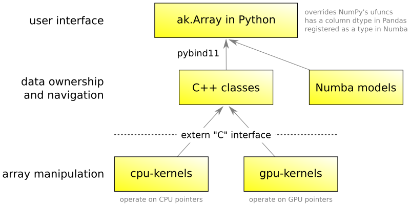

# Contributing to Awkward Array

Thank you for your interest in contributing! We're eager to see your ideas and look forward to working with you.

This document describes the technical procedures we follow in this project. I should also stress that as members of the Scikit-HEP community, we are all obliged to maintaining a welcoming, harassment-free environment. See the [Code of Conduct](https://scikit-hep.org/code-of-conduct) for details.

### Where to start

The front page for the Awkward Array project is its [GitHub README](https://github.com/scikit-hep/awkward-1.0#readme). This leads directly to tutorials and reference documentation that I assume you've already seen. It also includes instructions for [compiling for development](https://github.com/scikit-hep/awkward-1.0#installation-for-developers), using the localbuild.py script.

### Reporting issues

The first thing you should do if you want to fix something is to [submit an issue through GitHub](https://github.com/scikit-hep/awkward-1.0/issues). That way, we can all see it and maybe I or a member of the community knows of a solution that could save you the time spent fixing it. If you want to "own" the issue, you can signal your intent to fix it in the issue report.

### Contributing a pull request

Feel free to [open pull requests in GitHub](https://github.com/scikit-hep/awkward-1.0/pulls) from your forked repo when you start working on the problem. I recommend opening the pull request early so that we can see your progress and communicate about it. (Note that you can `git commit --allow-empty` to make an empty commit and start a pull request before you even have new code.)

Please [make the pull request a draft](https://github.blog/2019-02-14-introducing-draft-pull-requests/) to indicate that it is in an incomplete state and shouldn't be merged until you click "ready for review."

At present, I (Jim Pivarski, [jpivarski](https://github.com/jpivarski)) merge or close all pull requests for Awkward Array, though a team of maintainers should be enlisted in the future, as the project matures. When I'm working closely with a developer, such as a summer student, I'll sometimes give that developer permission to merge their own pull requests.

If you're waiting for me to review, comment upon, or merge a pull request, please do remind me by mentioning me (`@jpivarski`) in a comment. It's possible that I've forgotten and I apologize in advance. (I tend to give the person I'm currently working with my full attention, unfortunately at the expense of others.)

### Becoming a regular committer

If you want to contribute frequently, I'll grant you write access to the `scikit-hep/awkward-1.0` repo itself. This is more convenient than pull requests from forked repos because I can contribute corrections to your branch in fewer steps.

### Git practices

That said, most of the commits on a pull request/git branch should be from a single author. Corrections or suggestions from other authors are exceptional cases, when a particular change is easier to express as a code diff than in words.

As such, you should name your branch starting with your GitHub userid and a slash, such as `jpivarski/write-contributing-md`. If you start a pull request with a branch that doesn't follow convention, though, you don't need to fix it.

Most pull requests are merged with the "squash and merge" feature, so details about commit history within a pull request are lost. Feel free, therefore, to commit with any frequency you're comfortable with. I like to make frequent commits to avoid losing work to a dead laptop, and to have more save-points to recover from.

It is unnecessary to manually edit (rebase) your commit history. If, however, you do want to save a pull request as multiple commits on `master`, ask me and we'll discuss.

### Continuous integration

Pull requests must pass all [continuous integration](https://dev.azure.com/jpivarski/Scikit-HEP/_build?definitionId=3&_a=summary) tests before they are merged. I will sometimes cancel non-essential builds to give priority to pull requests that are almost ready to be merged. If you needed the result of the build as a diagnostic, you can ask me to restart your job or make a trivial change to trigger a new build.

Currently, we only run merge builds (the state of your branch if merged with master), not regular branch builds (the state of your branch as-is), because only merge builds can be made to run for pull requests from external forks and it makes better use of our limited execution time on Azure. If you want to enable regular branch builds, you can turn it on for your branch by editing `trigger/branches/exclude` in [.ci/azure-buildtest-awkwrad.yml](https://github.com/scikit-hep/awkward-1.0/blob/9b6fca3f6e6456860ae40979171f762e0045ce7c/.ci/azure-buildtest-awkward.yml#L1-L5). The merge build trigger is not controlled by the YAML file. It is better, however, to keep up-to-date with `git merge master`.

### The master branch

The Awkward Array `master` branch must be kept in an unbroken state. Although the recommended way to install Awkward Array is through pip or conda, the `master` branch on GitHub must always be functional. Pull requests for bug fixes and new features are based on `master`, so it has to work for users to test our proposed changes.

The `master` branch is also never far from the latest released version. The [release history](https://awkward-array.readthedocs.io/en/latest/_auto/changelog.html) shows that each release introduces at most several, sometimes only one, completed pull requests.

Committing directly to `master` is not allowed except for

   * updating the `VERSION_INFO` file, which should be independent of pull requests
   * updating documentation or non-code files
   * unprecedented emergencies

and only by me.

### Releases

Similarly, only I publish releases (or a team of maintainers, in the future). Publishing releases starts the deployment procedure, updating the package that users will get when they pip-install.

As stated above, new releases are published frequently, getting bug fixes and new features to users almost continuously. We prefer this over "big bang" releases with many changes.

## Project organization

The Awkward Array codebase consists of three main layers: the high-level user interface (in Python), data ownership and navigation (independently in C++ and lowered Numba), and array manipulation (in C++ and CUDA, behind a pure C interface).

  

Contributing to each part of the codebase has a different flavor:

   * The high-level code is focused on user experience, with careful attention to names, backward compatibility, duck typing, and interfaces with external libraries. Parts of it are more docstring than code.
   * The C++ code is focused on correct memory management and navigating data structures. It is *not* the place for performance optimizations, at least not unless motivated by specific metrics.
   * The Numba code requires familiarity with [Numba's extension mechanism](https://numba.pydata.org/numba-doc/dev/extending/index.html) (low-level only) and Numba internals.
   * The CPU kernels and GPU kernels are two implementations of the same functions, optimized for CPUs and GPUs, respectively. The pure C interface to these functions, and most of their implementations, involve only numbers and arrays. This *is* the place for performance optimizations.

A Contribution might only touch one layer of the code or it might involve more than one.

### Deployment products

Awkward Array consists of three shared libraries,

   * `libawkward-cpu-kernels.so` (or `.dylib`, etc.)
   * `libawkward-gpu-kernels.so`
   * `libawkward.so`

and a Python library shipped as binary wheels or (in rare cases) a source tarball to be compiled. The pip and conda deployments include all shared libraries with the Python package and put C++ headers in the system-dependent location for `includes`, in a directory named `awkward`.

### Performance considerations

The conventional model is that Python is for a good user interface and C++ is for performance. In the case of Awkward Array, even the C++ layer is not intended for high performance; this is pushed down to the CPU and GPU kernels. See the "[how-it-works tutorials for developers](https://scikit-hep.org/awkward-1.0/index.html)" for more on columnar data, but in typical applications, the number of C++ objects is small (hundreds to thousands of instances) while the size of array buffers sent to CPU and GPU kernels is large (billions of elements).

Thus, we freely take advantage of some "old" C++ practices that sacrifice performance for flexibility:

   * dynamic dispatch (virtual methods) instead of template specialization
   * copy constructors and naive argument passing instead of move semantics.

The CPU and GPU kernels, on the other hand, should be optimized for hardware cache throughput and vectorization. Performance improvements in CPU and GPU kernels are eagerly sought, while performance improvements in the C++ codebase have to be justified by significant gains.

Sometimes, changes in the C++ or even Python code can change the number or size of CPU and GPU kernels that need to be run, in which case they are easily justified performance corrections.

### General statements on coding style

Above all, the purpose of any programming language is to be read by humans; if we were only concerned with operating the machine, we would be flipping individual bits. It should be organized in stanzas that highlight similarities and differences by grouping them on the screen.

We adhere to an 80-character line width, which is a [standard in the industry](https://github.com/scikit-hep/awkward-1.0/pull/183), despite the fact that we don't write punch-cards anymore. The standardized width allows several window columns to be examined side-by-side. Exceptions to the 80-character limit follow [PEP 8](https://www.python.org/dev/peps/pep-0008/): we don't split URLs or similar tokens that must be read as a unit.

Unit tests do not need to adhere to the 80-character limit.

We don't, however, use automated formatters like clang-format or black. Automated formatting can rearrange code into something that is, paradoxically, harder to read, undermining the human element in programming.

We don't currently use linters like clang-tidy or flake8, but I'm open to it.

### Fully qualified names

We don't import names in C++ (`using`) or Python (`import from`) so that it's easy to see where objects come from and find all instances with a text search. This is sometimes in tension with the 80-character limit.

In C++, `using awkward as ak` and `using pybind11 as py` are standard shorthands. For end-users, `import awkward1 as ak` is recommended, but not in the codebase (including unit tests). We also don't use `import numpy as np` in the codebase, even though it is common in scripts.

### Compiler warnings

We should strive to eliminate all compiler warnings, including Linux (GCC), MacOS (Clang), and Windows (Visual Studio) builds on continuous integration. Warnings from other compilers and on other platforms have revealed bugs during Awkward Array's development.

It can, however, be difficult to diagnose errors that only show up in continuous integration. Most of the Windows errors and warnings have been related to 32-bit tests, which can be reproduced using 32-bit Linux in Docker images (getting dependencies from 32-bit conda). Most of the MacOS warnings have been related to symbol visibility and Clang specifics, which can also be emulated on other systems with access to a Clang compiler.

The insistence on eliminating compiler warnings, however, begs the question of "with which warnings enabled?" I have not answered this question (using only the default settings of GCC), but I would be welcome to suggestions.

### C++ standard

We use the C++11 version of the language, as it is a minimum required for pybind11 and a maximum allowed on the manylinux Docker images that compile the Python extension modules in a portable way.

As stated above, most of the C++ features we use are "old," such as virtual inheritance. We strive for simple code, rather than "smart" code, and the sweet spot for C++ is shared pointers (not raw pointers) and runtime program flow (not template metaprogramming).

A quick scan of the code would reveal that we make extensive use of `std::shared_ptr`. Raw pointers are used in extremely limited circumstances, and never passed out of the scope that holds a shared pointer to the same resource (guaranteeing its lifetime). The main use of raw pointers is for down-casting with `dynamic_cast`.

Class instances are passed between functions as generic types for flexibility. For example, `toListOffsetArray64` returns a list array converted to the `ListOffsetArray64` class, but it is passed as a smart pointer to the common superclass, `Content`. This is because passing as a `ListOffsetArray64` exposes typeinfo symbols that violate visibility rules.

Class hierarchies are intentionally simple. If any inheritance is involved, the one superclass is abstract and all subclasses are direct children of that abstract superclass.

Templating is only used for integer specialization.

### Python standard

We target Python 2.7 and recent versions of Python 3, currently starting with 3.5 (though that may move up to 3.6).

We only supprt Python 2.7 as much as is practical. For example, we ignore compiler warnings when compiling against Python 2.7 and any unit tests that depend on the difference are skipped for Python 2.7.

Python 2.7 and 3.5 have unstable dict order, which excludes them both from some tests.

### Third party dependencies

Awkward Array's C++ codebase only depends on pybind11 and rapidjson, which are both header-only and included as git submodules (the reason for the `git clone --recursive`).

The Python codebase only strictly depends on NumPy 1.13.1, the first version with [NEP 13](https://numpy.org/neps/nep-0013-ufunc-overrides.html). This fixes the minimum Python at 2.7.

Other third party libraries are used if they exist (can be imported), and we only accept certain versions of these libraries. Both the test-import and any version-testing must be within runtime code, not startup code, so that they're only invoked when users explicitly call for the feature that requires them.

Versions can be explicitly tested with `distutils.version.LooseVersion`, though it's better to test for features (existence of classes, methods, and attributes) than to test for explicit version numbers.
