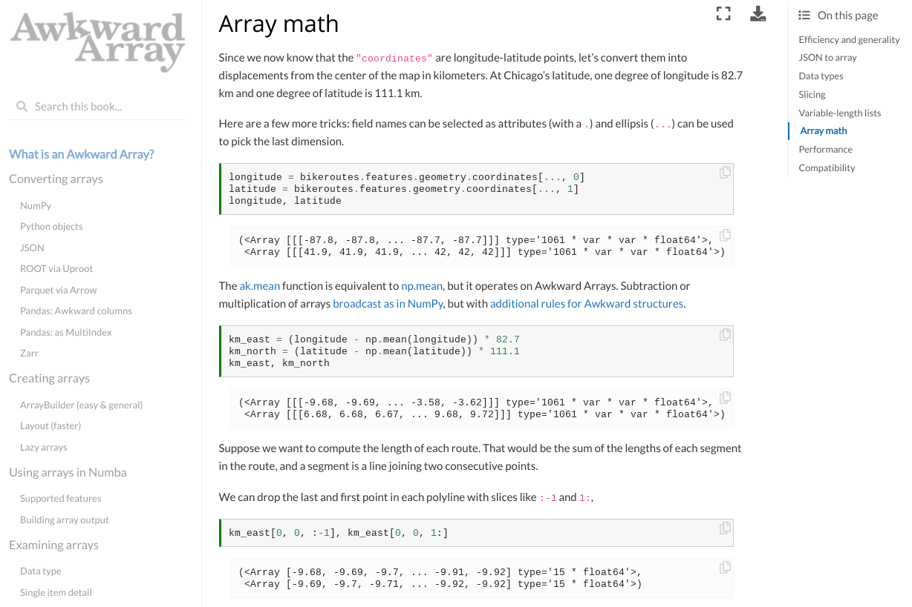

[](https://scikit-hep.org/)
[](https://nsf.gov/awardsearch/showAward?AWD_ID=1836650)
[](https://zenodo.org/badge/latestdoi/137079949)
[](https://www.python.org)
[](https://opensource.org/licenses/BSD-3-Clause)

Awkward Array is a library for **nested, variable-sized data**, including arbitrary-length lists, records, mixed types, and missing data, using **NumPy-like idioms**.

Arrays are **dynamically typed**, but operations on them are **compiled and fast**. Their behavior coincides with NumPy when array dimensions are regular and generalizes when they're not.

<table>
  <tr>
    <td width="66%" valign="top">
      <a href="https://awkward-array.org">
        
      </a>
      <p align="center"><b>
        <a href="https://awkward-array.org">
        How-to tutorials
        </a>
      </b></p>
    </td>
    <td width="33%" valign="top">
      <a href="https://awkward-array.readthedocs.io/en/latest/index.html">
        
      </a>
      <p align="center"><b>
        <a href="https://awkward-array.readthedocs.io/en/latest/index.html">
        Python API reference
        </a>
      </b></p>
      <a href="https://awkward-array.readthedocs.io/en/latest/_static/index.html">
        
      </a>
      <p align="center"><b>
        <a href="https://awkward-array.readthedocs.io/en/latest/_static/index.html">
        C++ API reference
        </a>
      </b></p>
    </td>
  </tr>
</table>

# Motivating example

Given an array of objects with `x`, `y` fields and variable-length nested lists like

```python
array = ak.Array([
    [{"x": 1.1, "y": [1]}, {"x": 2.2, "y": [1, 2]}, {"x": 3.3, "y": [1, 2, 3]}],
    [],
    [{"x": 4.4, "y": [1, 2, 3, 4]}, {"x": 5.5, "y": [1, 2, 3, 4, 5]}]
])
```

the following slices out the `y` values, drops the first element from each inner list, and runs NumPy's `np.square` function on everything that is left:

```python
output = np.square(array["y", ..., 1:])
```

The result is

```python
[
    [[], [4], [4, 9]],
    [],
    [[4, 9, 16], [4, 9, 16, 25]]
]
```

The equivalent using only Python is

```python
output = []
for sublist in array:
    tmp1 = []
    for record in sublist:
        tmp2 = []
        for number in record["y"][1:]:
            tmp2.append(np.square(number))
        tmp1.append(tmp2)
    output.append(tmp1)
```

Not only is the expression using Awkward Arrays more concise, using idioms familiar from NumPy, but it's much faster and uses less memory.

For a similar problem 10 million times larger than the one above (on a single-threaded 2.2 GHz processor),

   * the Awkward Array one-liner takes **4.6 seconds** to run and uses **2.1 GB** of memory,
   * the equivalent using Python lists and dicts takes **138 seconds** to run and uses **22 GB** of memory.

Speed and memory factors in the double digits are common because we're replacing Python's dynamically typed, pointer-chasing virtual machine with type-specialized, precompiled routines on contiguous data. (In other words, for the same reasons as NumPy.) Even higher speedups are possible when Awkward Array is paired with [Numba](https://numba.pydata.org/).

Our [presentation at SciPy 2020](https://youtu.be/WlnUF3LRBj4) provides a good introduction, showing how to use these arrays in a real analysis.

# Installation

Awkward Array can be installed [from PyPI](https://pypi.org/project/awkward1/) using pip:

```bash
pip install awkward1
```

Most users will get a precompiled binary (wheel) for your operating system and Python version. If not, the above attempts to compile from source.

   * Report bugs, request features, and ask for additional documentation on [GitHub Issues](https://github.com/scikit-hep/awkward-1.0/issues). If you have a general "How do I…?" question, we'll answer it as a new [example in the tutorial](https://awkward-array.org/how-to.html).
   * If you have a problem that's too specific to be new documentation or it isn't exclusively related to Awkward Array, it might be more appropriate to ask on [StackOverflow with the [awkward-array] tag](https://stackoverflow.com/questions/tagged/awkward-array). Be sure to include tags for any other libraries that you use, such as Pandas or PyTorch.
   * The [Gitter Scikit-HEP/community](https://gitter.im/Scikit-HEP/community) is a way to get in touch with all Scikit-HEP developers and users.

## Installation for developers

Be sure to clone this repository recursively to get the header-only C++ dependencies.

```bash
git clone --recursive https://github.com/scikit-hep/awkward-1.0.git
```

You can install it on your system with pip, which uses exactly the same procedure as deployment. This is recommended if you **do not** expect to change the code.

```bash
pip install .[test,dev]
```

Or you can build it locally for incremental development. The following reuses a local directory so that you only recompile what you've changed. This is recommended if you **do** expect to change the code.

```bash
python localbuild.py --pytest tests
```

The `--pytest tests` runs the integration tests from the `tests` directory (drop it to build only).

For more fine-grained testing, we also have tests of the low-level kernels, which can be invoked with

```bash
python dev/generate-kernelspec.py
python dev/generate-tests.py
python -m pytest -vv -rs tests-spec
python -m pytest -vv -rs tests-cpu-kernels
```

Furthermore, if you have an Nvidia GPU, you can build and locally install the experimental CUDA plug-in with

```bash
pip uninstall -y awkward1-cuda-kernels
python dev/generate-cuda.py
./cuda-build.sh --install
```

The `--install` does a local `pip install` on your system, which is the only way to use it. You can run its tests with

```bash
python dev/generate-tests.py
python -m pytest -vv -rs tests-cuda-kernels
python -m pytest -vv -rs tests-cuda
```

   * [Continuous integration](https://dev.azure.com/jpivarski/Scikit-HEP/_build?definitionId=3&_a=summary) and [continuous deployment](https://dev.azure.com/jpivarski/Scikit-HEP/_build?definitionId=4&_a=summary) are hosted by [Azure Pipelines](https://azure.microsoft.com/en-us/services/devops/pipelines/).
   * [Release history](https://awkward-array.readthedocs.io/en/latest/_auto/changelog.html) (changelog) is hosted by [ReadTheDocs](https://readthedocs.org).
   * [awkward-array.org](https://awkward-array.org) is hosted by [Netlify](https://www.netlify.com).
   * [CONTRIBUTING.md](CONTRIBUTING.md) for technical information on how to contribute.
   * [Code of conduct](https://scikit-hep.org/code-of-conduct) for how we work together.
   * The [LICENSE](LICENSE) is BSD-3.

## Using Awkward Array as a dependency

Python projects can simply `import awkward1`.

C++ projects can link against the shared libraries `libawkward-cpu-kernels.so` and `libawkward.so` or their static library equivalents. These libraries are shipped, along with the include files, as part of pip's installation.

   * See the [dependent-project](https://github.com/scikit-hep/awkward-1.0/tree/master/dependent-project) directory for examples.

# Papers and talks about Awkward Array

   * [Original motivations document](https://docs.google.com/document/d/1lj8ARTKV1_hqGTh0W_f01S6SsmpzZAXz9qqqWnEB3j4/edit?usp=sharing) from July 2019, now out-of-date.
   * [StrangeLoop talk](https://youtu.be/2NxWpU7NArk) on September 14, 2019.
   * [PyHEP talk](https://indico.cern.ch/event/833895/contributions/3577882) on October 17, 2019.
   * [CHEP talk](https://indico.cern.ch/event/773049/contributions/3473258) on November 7, 2019.
   * [CHEP 2019 proceedings](https://arxiv.org/abs/2001.06307) (to be published in _EPJ Web of Conferences_).
   * [Demo for Coffea developers](https://github.com/scikit-hep/awkward-1.0/blob/master/docs-demo-notebooks/2019-12-20-coffea-demo.ipynb) on December 20, 2019.
   * [Demo for Numba developers](https://github.com/scikit-hep/awkward-1.0/blob/master/docs-demo-notebooks/2020-01-22-numba-demo-EVALUATED.ipynb) on January 22, 2020.
   * [Summary poster](https://github.com/jpivarski/2020-02-27-irishep-poster/blob/master/pivarski-irishep-poster.pdf) on February 27, 2020.
   * [Demo for Electron Ion Collider users](https://github.com/jpivarski/2020-04-08-eic-jlab#readme) ([video](https://www.youtube.com/watch?v=FoxNS6nlbD0)) on April 8, 2020.
   * [Presentation at SciPy 2020](https://youtu.be/WlnUF3LRBj4) (video) on July 5, 2020.
   * [Tutorial at PyHEP 2020](https://youtu.be/ea-zYLQBS4U) (video with [interactive notebook on Binder](https://mybinder.org/v2/gh/jpivarski/2020-07-13-pyhep2020-tutorial.git/1.1?urlpath=lab/tree/tutorial.ipynb)) on July 13, 2020.

# Acknowledgements

Support for this work was provided by NSF cooperative agreement OAC-1836650 (IRIS-HEP), grant OAC-1450377 (DIANA/HEP) and PHY-1520942 (US-CMS LHC Ops).

Thanks especially to the gracious help of awkward-array contributors (including the [original repository](https://github.com/scikit-hep/awkward-array)).

<!-- ALL-CONTRIBUTORS-LIST:START - Do not remove or modify this section -->
<!-- prettier-ignore-start -->
<!-- markdownlint-disable -->
<table>
  <tr>
    <td align="center"><a href="https://github.com/jpivarski"><br /><sub><b>Jim Pivarski</b></sub></a><br /><a href="https://github.com/scikit-hep/awkward-1.0/commits?author=jpivarski" title="Code">💻</a> <a href="https://github.com/scikit-hep/awkward-1.0/commits?author=jpivarski" title="Documentation">📖</a> <a href="#infra-jpivarski" title="Infrastructure (Hosting, Build-Tools, etc)">🚇</a> <a href="#maintenance-jpivarski" title="Maintenance">🚧</a></td>
    <td align="center"><a href="https://github.com/ianna"><br /><sub><b>Ianna Osborne</b></sub></a><br /><a href="https://github.com/scikit-hep/awkward-1.0/commits?author=ianna" title="Code">💻</a></td>
    <td align="center"><a href="https://github.com/reikdas"><br /><sub><b>Pratyush Das</b></sub></a><br /><a href="https://github.com/scikit-hep/awkward-1.0/commits?author=reikdas" title="Code">💻</a></td>
    <td align="center"><a href="https://github.com/trickarcher"><br /><sub><b>Anish Biswas</b></sub></a><br /><a href="https://github.com/scikit-hep/awkward-1.0/commits?author=trickarcher" title="Code">💻</a></td>
    <td align="center"><a href="https://github.com/glass-ships"><br /><sub><b>glass-ships</b></sub></a><br /><a href="https://github.com/scikit-hep/awkward-1.0/commits?author=glass-ships" title="Code">💻</a> <a href="https://github.com/scikit-hep/awkward-1.0/commits?author=glass-ships" title="Tests">⚠️</a></td>
    <td align="center"><a href="http://iscinumpy.gitlab.io"><br /><sub><b>Henry Schreiner</b></sub></a><br /><a href="https://github.com/scikit-hep/awkward-1.0/commits?author=henryiii" title="Code">💻</a> <a href="#infra-henryiii" title="Infrastructure (Hosting, Build-Tools, etc)">🚇</a></td>
    <td align="center"><a href="https://github.com/nsmith-"><br /><sub><b>Nicholas Smith</b></sub></a><br /><a href="https://github.com/scikit-hep/awkward-1.0/commits?author=nsmith-" title="Code">💻</a> <a href="https://github.com/scikit-hep/awkward-1.0/commits?author=nsmith-" title="Tests">⚠️</a></td>
  </tr>
  <tr>
    <td align="center"><a href="https://github.com/lgray"><br /><sub><b>Lindsey Gray</b></sub></a><br /><a href="https://github.com/scikit-hep/awkward-1.0/commits?author=lgray" title="Code">💻</a> <a href="https://github.com/scikit-hep/awkward-1.0/commits?author=lgray" title="Tests">⚠️</a></td>
    <td align="center"><a href="https://github.com/Ellipse0934"><br /><sub><b>Ellipse0934</b></sub></a><br /><a href="https://github.com/scikit-hep/awkward-1.0/commits?author=Ellipse0934" title="Tests">⚠️</a></td>
    <td align="center"><a href="https://gitlab.com/veprbl"><br /><sub><b>Dmitry Kalinkin</b></sub></a><br /><a href="#infra-veprbl" title="Infrastructure (Hosting, Build-Tools, etc)">🚇</a></td>
    <td align="center"><a href="https://www.linkedin.com/in/charles-c-escott/"><br /><sub><b>Charles Escott</b></sub></a><br /><a href="https://github.com/scikit-hep/awkward-1.0/commits?author=EscottC" title="Code">💻</a></td>
    <td align="center"><a href="https://github.com/masonproffitt"><br /><sub><b>Mason Proffitt</b></sub></a><br /><a href="https://github.com/scikit-hep/awkward-1.0/commits?author=masonproffitt" title="Code">💻</a></td>
    <td align="center"><a href="https://github.com/mhedges"><br /><sub><b>Michael Hedges</b></sub></a><br /><a href="https://github.com/scikit-hep/awkward-1.0/commits?author=mhedges" title="Code">💻</a></td>
    <td align="center"><a href="https://github.com/guitargeek"><br /><sub><b>Jonas Rembser</b></sub></a><br /><a href="https://github.com/scikit-hep/awkward-1.0/commits?author=guitargeek" title="Code">💻</a></td>
  </tr>
  <tr>
    <td align="center"><a href="https://github.com/Jayd-1234"><br /><sub><b>Jaydeep Nandi</b></sub></a><br /><a href="https://github.com/scikit-hep/awkward-1.0/commits?author=Jayd-1234" title="Code">💻</a></td>
    <td align="center"><a href="https://github.com/benkrikler"><br /><sub><b>benkrikler</b></sub></a><br /><a href="https://github.com/scikit-hep/awkward-1.0/commits?author=benkrikler" title="Code">💻</a></td>
    <td align="center"><a href="https://github.com/bfis"><br /><sub><b>bfis</b></sub></a><br /><a href="https://github.com/scikit-hep/awkward-1.0/commits?author=bfis" title="Code">💻</a></td>
    <td align="center"><a href="https://ddavis.io/"><br /><sub><b>Doug Davis</b></sub></a><br /><a href="https://github.com/scikit-hep/awkward-1.0/commits?author=douglasdavis" title="Code">💻</a></td>
    <td align="center"><a href="http://twitter: @JoosepPata"><br /><sub><b>Joosep Pata</b></sub></a><br /><a href="#ideas-jpata" title="Ideas, Planning, & Feedback">🤔</a></td>
    <td align="center"><a href="http://martindurant.github.io/"><br /><sub><b>Martin Durant</b></sub></a><br /><a href="#ideas-martindurant" title="Ideas, Planning, & Feedback">🤔</a></td>
    <td align="center"><a href="http://gordonwatts.wordpress.com"><br /><sub><b>Gordon Watts</b></sub></a><br /><a href="#ideas-gordonwatts" title="Ideas, Planning, & Feedback">🤔</a></td>
  </tr>
  <tr>
    <td align="center"><a href="https://gitlab.com/nikoladze"><br /><sub><b>Nikolai Hartmann</b></sub></a><br /><a href="https://github.com/scikit-hep/awkward-1.0/commits?author=nikoladze" title="Code">💻</a></td>
    <td align="center"><a href="https://github.com/sjperkins"><br /><sub><b>Simon Perkins</b></sub></a><br /><a href="https://github.com/scikit-hep/awkward-1.0/commits?author=sjperkins" title="Code">💻</a></td>
  </tr>
</table>

<!-- markdownlint-enable -->
<!-- prettier-ignore-end -->
<!-- ALL-CONTRIBUTORS-LIST:END -->

💻: code, 📖: documentation, 🚇: infrastructure, 🚧: maintainance, ⚠: tests and feedback, 🤔: foundational ideas.
