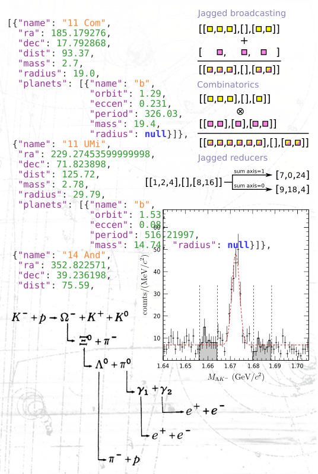
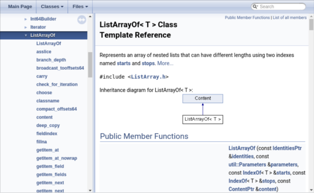
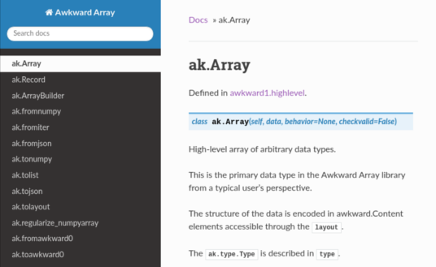

Awkward Array is a library for **nested, variable-sized data**, including arbitrary-length lists, records, mixed types, and missing data, using **NumPy-like idioms**.

Arrays are **dynamically typed**, but operations on them are **compiled and fast**. Their behavior coincides with NumPy when array dimensions are regular and generalizes when they're not.

<table>
  <tr>
    <td width="33%" valign="top">
      <a href="https://scikit-hep.org/awkward-1.0/index.html">
        
      </a>
      <p align="center"><b>
        <a href="https://scikit-hep.org/awkward-1.0/index.html">
        How-to documentation<br>for data analysts
        </a>
      </b></p>
    </td>
    <td width="33%" valign="top">
      <a href="https://scikit-hep.org/awkward-1.0/index.html">
        
      </a>
      <p align="center"><b>
        <a href="https://scikit-hep.org/awkward-1.0/index.html">
        How-it-works tutorials<br>for developers
        </a>
      </b></p>
    </td>
    <td width="33%" valign="top">
      <a href="https://awkward-array.readthedocs.io/en/latest/_static/index.html">
        
      </a>
      <p align="center"><b>
        <a href="https://awkward-array.readthedocs.io/en/latest/_static/index.html">
        C++<br>API reference
        </a>
      </b></p>
      <a href="https://awkward-array.readthedocs.io/en/latest/index.html">
        
      </a>
      <p align="center"><b>
        <a href="https://awkward-array.readthedocs.io/en/latest/index.html">
        Python<br>API reference
        </a>
      </b></p>
    </td>
  </tr>
</table>

# Installation

Awkward Array can be installed [from PyPI](https://pypi.org/project/awkward1/) using pip:

```bash
pip install awkward1
```

Most users will get a precompiled binary (wheel) for your operating system and Python version. If not, the above attempts to compile from source.

   * Report any bugs on [GitHub Issues](https://github.com/scikit-hep/awkward-1.0/issues).
   * Ask any "how do I?" questions on [StackOverflow tagged as [awkward-array]](https://stackoverflow.com/questions/tagged/awkward-array).
   * Realtime chat on [Gitter Scikit-HEP/community](https://gitter.im/Scikit-HEP/community).

## Installation for developers

Be sure to clone this repository recursively to get the header-only C++ dependencies.

```bash
git clone --recursive https://github.com/scikit-hep/awkward-1.0.git
```

You can install it on your system with pip, which uses exactly the same procedure as deployment. This is recommended if you **do not** expect to change the code.

```bash
pip install .[test,dev]
```

Or you can build it locally for incremental development. The following reuses a local directory so that you only recompile what you've changed. This is recommended if you **do** expect to change the code.

```bash
python localbuild.py --pytest tests
```

   * [Continuous integration](https://dev.azure.com/jpivarski/Scikit-HEP/_build?definitionId=3&_a=summary) and [continuous deployment](https://dev.azure.com/jpivarski/Scikit-HEP/_build?definitionId=4&_a=summary) are hosted by Azure Pipelines.
   * [Release history](https://awkward-array.readthedocs.io/en/latest/_auto/changelog.html) (changelog) is hosted by ReadTheDocs.
   * [CONTRIBUTING.md](CONTRIBUTING.md) provides more information on how to contribute.

## Using Awkward Array as a dependency

Python projects can simply `import awkward1`.

C++ projects can link against the shared libraries `libawkward-cpu-kernels.so` and `libawkward.so` or their static library equivalents. These libraries are shipped, along with the include files, as part of pip's installation.

   * See the [dependent-project](https://github.com/scikit-hep/awkward-1.0/tree/master/dependent-project) directory for examples.

# Papers and talks about Awkward Array

   * [Original motivations document](https://docs.google.com/document/d/1lj8ARTKV1_hqGTh0W_f01S6SsmpzZAXz9qqqWnEB3j4/edit?usp=sharing) from July 2019, now out-of-date.
   * [StrangeLoop talk](https://youtu.be/2NxWpU7NArk) on September 14, 2019.
   * [PyHEP talk](https://indico.cern.ch/event/833895/contributions/3577882) on October 17, 2019.
   * [CHEP talk](https://indico.cern.ch/event/773049/contributions/3473258) on November 7, 2019.
   * [CHEP 2019 proceedings](https://arxiv.org/abs/2001.06307) (to be published in _EPJ Web of Conferences_).
   * [Demo for Coffea developers](https://github.com/scikit-hep/awkward-1.0/blob/master/docs-demo-notebooks/2019-12-20-coffea-demo.ipynb) on December 20, 2019.
   * [Demo for Numba developers](https://github.com/scikit-hep/awkward-1.0/blob/master/docs-demo-notebooks/2020-01-22-numba-demo-EVALUATED.ipynb) on January 22, 2020.
   * [Summary poster](https://github.com/jpivarski/2020-02-27-irishep-poster/blob/master/pivarski-irishep-poster.pdf) on February 27, 2020.
   * [Demo for Electron Ion Collider users](https://github.com/jpivarski/2020-04-08-eic-jlab#readme) ([video](https://www.youtube.com/watch?v=FoxNS6nlbD0)) on April 8, 2020.
