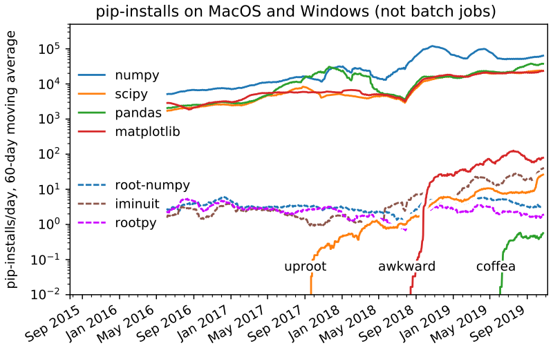
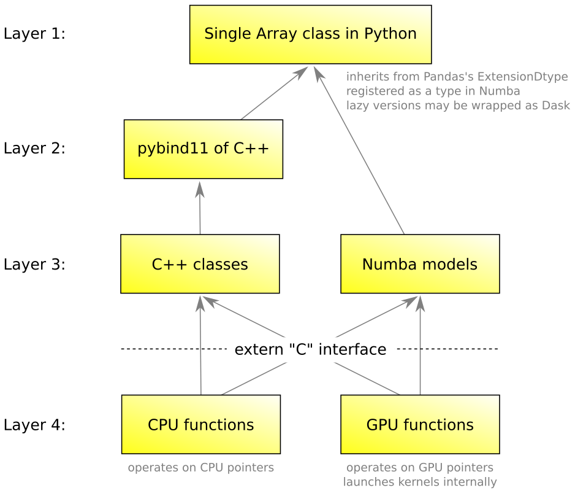

# awkward-1.0

Development of Awkward 1.0, to replace [scikit-hep/awkward-array](https://github.com/scikit-hep/awkward-array#readme) in 2020.

   * The [original motivations document](https://docs.google.com/document/d/1lj8ARTKV1_hqGTh0W_f01S6SsmpzZAXz9qqqWnEB3j4/edit?usp=sharing) from July 2019, now a little out-of-date.
   * My [PyHEP talk](https://indico.cern.ch/event/833895/contributions/3577882) on October 17, 2019.
   * My [CHEP talk](https://indico.cern.ch/event/773049/contributions/3473258) on November 7, 2019.

## Motivation for a new Awkward Array

Awkward Array has proven to be a useful way to analyze variable-length and tree-like data in Python, by extending Numpy's idioms from rectilinear arrays to arrays of complex data structures. For over a year, physicists have been using Awkward Array both in and out of [uproot](https://github.com/scikit-hep/uproot#readme); it is already one of the most popular Python packages in particle physics.

<p align="center"></p>

However, its pure-NumPy implementation is hard to extend (finding for-loop-free implementations of operations on nested data is _hard_) and maintain (most bugs are NumPy corner cases). Also, the feedback users have given me through [GitHub](https://github.com/scikit-hep/awkward-array/issues), [StackOverflow](https://stackoverflow.com/questions/tagged/awkward-array), and [in-person tutorials](https://github.com/jpivarski/2019-07-29-dpf-python#readme) have pointed out some design mistakes. A backward-incompatible release will allow us to fix design mistakes while providing freedom to make deep changes in the implementation.

The Awkward 1.0 project is a major investment, a six-month sprint from late August 2019 to late February 2020. The time spent on a clean, robust Awkward Array is justified by the widespread adoption of Awkward 0.x: its usefulness to the community has been demonstrated.

## Main goals of Awkward 1.0

   * Full access to create and manipulate Awkward Arrays in C++ with no Python dependencies. This is so that C++ libraries can produce and share data with Python front-ends.
   * Easy installation with `pip install` and `conda install` for most users (Mac, Windows, and [most Linux](https://github.com/pypa/manylinux)).
   * Imperative (for-loop-style) access to Awkward Arrays in [Numba](https://numba.pydata.org/), a just-in-time compiler for Python. This is so that physicists can write critical loops in straightforward Python without a performance penalty.
   * A single `awkward.Array` class that hides the details of how columnar data is built, with a suite of operations that apply to all internal types.
   * Conformance to NumPy, where Awkward and NumPy overlap.
   * Better control over "behavioral mix-ins," such as `LorentzVector` (i.e. adding methods like `pt()` to arrays of records with `px` and `py` fields). In Awkward 0.x, this was achieved with multiple inheritance, but that was brittle.
   * Support for set operations and database-style joins, which can be put to use in a [declarative analysis language](https://github.com/jpivarski/PartiQL#readme), but requires database-style accounting of an index (like a Pandas index).
   * Better interoperability with Pandas, NumExpr, and Dask, while maintaining support for ROOT, Arrow, and Parquet.
   * Ability to add GPU implementations of array operations in the future.
   * Better error messages and extensive documentation.

## Architecture of Awkward 1.0

To achieve these goals, Awkward 1.0 is separated into four layers:

   1. The user-facing Python layer with a single `awkward.Array` class, whose data is described by a [datashape](https://datashape.readthedocs.io/en/latest/) type.
   2. The columnar representation (i.e. nested `ListArray`, `RecordArray`, etc.) is accessible but hidden, and these are all C++ classes presented to Python through [pybind11](https://pybind11.readthedocs.io/en/stable/).
   3. Two object models for the columnar representation, one in C++11 (with only header-only dependencies) and the other as [Numba extensions](https://numba.pydata.org/numba-doc/dev/extending/index.html). This is the only layer in which array-allocation occurs.
   4. A suite of operations on arrays, computing new values but not allocating memory. The first implementation of this suite is in C++ with a pure-C interface; the second may be CUDA (or other GPU language). With one exception (`FillableArray`), iterations over arrays only occur at this level, so performance optimizations can focus on this layer.

<p align="center"></p>

## The Awkward transition

Since Awkward 1.0 is not backward-compatible, existing users of Awkward 0.x will need to update their scripts or only use the new version on new scripts. Awkward 1.0 is already available to early adopters as [awkward1 in pip](https://pypi.org/project/awkward1/) (`pip install awkward1` and `import awkward1` in Python). When [uproot](https://github.com/scikit-hep/uproot#readme) is ready to use the new Awkward Array,

   * it will be released as **uproot 4.0**,
   * **awkward1** will be renamed **awkward**, and
   * the old Awkward 0.x will be renamed **awkward0**.

The original Awkward 0.x will be available in perpetuity as **awkward0**, but only minor bugs will be fixed, and that only for the duration of 2020. This repository will replace [scikit-hep/awkward-array](https://github.com/scikit-hep/awkward-array#readme) on GitHub.

## Compiling from source

Awkward 1.0 is available to early adopters as [awkward1 in pip](https://pypi.org/project/awkward1/) (`pip install awkward1` and `import awkward1` in Python), but developers will need to compile from source. For that, you will need

   * [CMake/CTest](https://cmake.org/),
   * a C++11-compliant compiler,

and optionally

   * Python 2.7, 3.5, 3.6, 3.7, or 3.8 (CPython, not an alternative like PyPy),
   * NumPy 1.13.1 or later,
   * pytest 3.9 or later (to run tests),
   * Numba 0.46 or later (to run all the tests).

To get the code from GitHub, be sure to use `--recursive` to get Awkward's git-module dependencies (pybind11 and RapidJSON):

```bash
git clone --recursive https://github.com/scikit-hep/awkward-1.0.git
```

To compile _without Python_ (unusual case):

```bash
mkdir build
cd build
cmake ..
make all
make CTEST_OUTPUT_ON_FAILURE=1 test    # optional: run C++ tests
cd ..
```

To compile _with Python_ (the usual case):

```bash
python setup.py build
pytest -vv tests                       # optional: run Python tests
```

In lieu of "make clean" for Python builds, I use the following to remove compiled code from the source tree:

```bash
rm -rf **/*~ **/__pycache__ build dist *.egg-info awkward1/*.so **/*.pyc
```

<br>
<p align="center">See Azure Pipelines <a href="https://dev.azure.com/jpivarski/Scikit-HEP/_build?definitionId=3&_a=summary">buildtest-awkward</a> (CI) and <a href="https://dev.azure.com/jpivarski/Scikit-HEP/_build?definitionId=4&_a=summary">deploy-awkward</a> (CD).</p>
<br>

## Roadmap

**The six-month sprint:**

   * [X] **September 2019:** Set up CI/CD; define jagged array types in C++; pervasive infrastructure like database-style indexing.
   * [X] **October 2019:** NumPy-compliant slicing; the Numba implementation. Feature parity will be maintained in Numba continuously.
   * [X] **November 2019:** Fillable arrays to create columnar data; high-level type objects; all list and record types.
   * [X] **December 2019:** The `awkward.Array` user interface; behavioral mix-ins, including the string type.
   * [ ] **January 2020:** [NEP 13](https://www.numpy.org/neps/nep-0013-ufunc-overrides.html) and [NEP 18](https://www.numpy.org/neps/nep-0018-array-function-protocol.html); the rest of the array nodes: option and union types, indirection, chunking, and laziness.
   * [ ] **February 2020:** The array operations: flattening, padding, concatenating, combinatorics, etc.

**Updating dependent libraries:**

   * [ ] **March 2020:** Update [vector](https://github.com/scikit-hep/vector) (from [hepvector](https://github.com/henryiii/hepvector#readme) and [uproot-methods](https://github.com/scikit-hep/uproot-methods#readme)). This work will be done with [Henry Schreiner](https://github.com/henryiii).
   * [ ] **April 2020:** Update [uproot](https://github.com/scikit-hep/uproot#readme) to 4.0 using Awkward 1.0.

Most users will see Awkward 1.0 for the first time when uproot 4.0 is released.

<br>
<p align="center"><b>Progress is currently on track.</b></p>
<br>

### Checklist of features for the six-month sprint

Completed items are ☑check-marked. See [closed PRs](https://github.com/scikit-hep/awkward-1.0/pulls?q=is%3Apr+is%3Aclosed) for more details.

   * [X] Cross-platform, cross-Python version build and deploy process. Regularly deploying [30 wheels](https://pypi.org/project/awkward1/#files) after closing each PR.
   * [X] Basic `NumpyArray`, `ListArray`, and `ListOffsetArray` with `__getitem__` for int/slice and `__iter__` in C++/pybind11 to establish structure and ensure proper reference counting.
   * [X] Introduce `Identity` as a Pandas-style index to pass through `__getitem__`.
   * [X] Reproduce all of the above as Numba extensions (make `NumpyArray`, `ListArray`, and `ListOffsetArray` usable in Numba-compiled functions).
   * [X] Error messages with location-of-failure information if the array has an `Identity` (except in Numba).
   * [X] Fully implement `__getitem__` for int/slice/intarray/boolarray/tuple (placeholders for newaxis/ellipsis), with perfect agreement with [Numpy basic/advanced indexing](https://docs.scipy.org/doc/numpy/reference/arrays.indexing.html), to all levels of depth.
   * [X] Appendable arrays (a distinct phase from readable arrays, when the type is still in flux) to implement `awkward.fromiter` in C++.
      * [X] Implemented all types but records; tested all primitives and lists.
      * [X] Expose appendable arrays to Numba.
      * [X] Implement appendable records.
      * [X] Test all (tested in mock [studies/fillable.py](tree/master/studies/fillable.py)).
   * [X] JSON → Awkward via header-only [RapidJSON](https://rapidjson.org) and `awkward.fromiter`.
   * [ ] Explicit broadcasting functions for jagged and non-jagged arrays and scalars.
   * [ ] Extend `__getitem__` to take jagged arrays of integers and booleans (same behavior as old).
   * [ ] Full suite of array types:
      * [X] `EmptyArray`: 1-dimensional array with length 0 and unknown type (result of `UnknownFillable`, compatible with all types of arrays).
      * [X] `RawArray`: flat, 1-dimensional array type for pure C++ (header-only).
      * [X] `NumpyArray`: rectilinear, N-dimensional array type without Python/pybind11 dependencies, but intended for Numpy.
      * [X] `ListArray`: the new `JaggedArray`, based on `starts` and `stops` (i.e. fully general).
      * [X] `ListOffsetArray`: the `JaggedArray` case with no unreachable data between reachable data (gaps).
      * [X] `RegularArray`: for building rectilinear, N-dimensional arrays of arbitrary contents, e.g. putting jagged dimensions inside fixed dimensions.
      * [X] `RecordArray`: the new `Table` _without_ lazy-slicing.
         * [X] Implement it in Numba as well.
      * [ ] `ByteMaskedArray`: for nullable data with a byte mask (for NumPy).
      * [ ] `BitMaskedArray`: for nullable data with a bit mask (for Arrow).
      * [ ] `UnmaskedArray`: for optional type without actually having a mask.
      * [ ] `IndexedArray`: same as the old version `IndexedMaskedArray`, has option type.
      * [ ] `UnionArray`: same as the old version; `SparseUnionArray`: the additional case found in Apache Arrow.
      * [ ] `RedirectArray`: an explicit weak-reference to another part of the structure (no hard-linked cycles). Often used with an `IndexedArray`.
      * [ ] `SlicedArray`: lazy-slicing (from old `Table`) that can be applied to any type.
      * [ ] `SparseArray`: same as the old version, but now we need a good lookup mechanism.
      * [ ] `ChunkedArray`: same as the old version, except that the type is a union if chunks conflict, not an error, and knowledge of all chunk sizes is always required. (Maybe `AmorphousChunkedArray` would fill that role.)
      * [ ] `RegularChunkedArray`: like a `ChunkedArray`, but all chunks are known to have the same size.
      * [ ] `VirtualArray`: same as the old version, including caching, but taking C++11 lambda functions for materialization, get-cache, and put-cache. The pybind11 layer will connect this to Python callables.
      * [ ] `PyVirtualArray`: takes a Python lambda (which gets carried into `VirtualArray`).
      * [ ] `PyObjectArray`: same as the old version.
   * [X] Describe high-level types using [datashape](https://datashape.readthedocs.io/en/latest/) and possibly also an in-house schema. (Emit datashape _strings_ from C++.)
   * [ ] Translation to and from Apache Arrow and Parquet in C++.
   * [X] Layer 1 interface `Array`:
      * [X] Pass through to the layout classes in Python and Numba.
      * [ ] Pass through Numpy ufuncs using [NEP 13](https://www.numpy.org/neps/nep-0013-ufunc-overrides.html) (as before).
      * [ ] Pass through other Numpy functions using [NEP 18](https://www.numpy.org/neps/nep-0018-array-function-protocol.html) (this would be new).
      * [ ] `RecordArray` fields (not called "columns" anymore) through Layer 1 `__getattr__`.
      * [X] Special Layer 1 `Record` type for `RecordArray` elements, supporting some methods and a visual representation based on `Identity` if available, all fields if `recordtype == "tuple"`, or the first field otherwise.
      * [X] Mechanism for adding user-defined `Methods` like `LorentzVector`, as before, but only on Layer 1.
         * [X] High-level classes for characters and strings.
      * [ ] Inerhit from Pandas so that all Layer 1 arrays can be DataFrame columns.
   * [ ] Full suite of operations:
      * [X] `awkward.tolist`: same as before.
      * [X] `awkward.fromiter`: same as before.
      * [X] `awkward.typeof`: reports the high-level type (accepting some non-awkward objects).
      * [ ] `awkward.tonumpy`: to force conversion to Numpy, if possible. Neither Layer 1 nor Layer 2 will have an `__array__` method; in the Numpy sense, they are not "array-like" or "array-compatible."
      * [ ] `awkward.topandas`: flattening jaggedness into `MultiIndex` rows and nested records into `MultiIndex` columns. This is distinct from the arrays' inheritance from Pandas, distinct from the natural ability to use any one of them as DataFrame columns.
      * [ ] `awkward.flatten`: same as old with an `axis` parameter.
      * [ ] Reducers, such as `awkward.sum`, `awkward.max`, etc., supporting an `axis` method.
      * [ ] The non-reducers: `awkward.moment`, `awkward.mean`, `awkward.var`, `awkward.std`.
      * [ ] `awkward.argmin`, `awkward.argmax`, `awkward.argsort`, and `awkward.sort`: same as old.
      * [ ] `awkward.where`: like `numpy.where`; old doesn't have this yet, but we'll need it.
      * [ ] `awkward.concatenate`: same as old, but supporting `axis` at any depth.
      * [ ] `awkward.zip`: makes jagged tables; this is a naive version of `awkward.join` below.
      * [ ] `awkward.pad`: same as old, but without the `clip` option (use slicing instead).
      * [ ] `awkward.fillna`: same as old.
      * [ ] `awkward.cross` (and `awkward.argcross`): to make combinations by cross-joining multiple arrays; option to use `Identity` index.
      * [ ] `awkward.choose` (and `awkward.argchoose`): to make combinations by choosing a fixed number from a single array; option to use `Identity` index and an option to include same-object combinations.
      * [ ] `awkward.join`: performs an inner join of multiple arrays; requires `Identity`. Because the `Identity` is a surrogate index, this is effectively a per-event intersection, zipping all fields.
      * [ ] `awkward.union`: performs an outer join of multiple arrays; requires `Identity`. Because the `Identity` is a surrogate index, this is effectively a per-event union, zipping fields where possible.

### Soon after the six-month sprint

   * [ ] Update [hepvector](https://github.com/henryiii/hepvector#readme) to be Derived classes, replacing the `TLorentzVectorArray` in uproot-methods.
   * [ ] Update uproot (on a branch) to use Awkward 1.0.
   * [ ] Start the `awkward → awkward0`, `awkward1 → awkward` transition.
   * [ ] Persistence to any medium that stores named binary blobs, as before, but accessible via C++ (especially for writing). The persistence format might differ slightly from the existing one (break backward compatibility, if needed).
   * [ ] Universal `array.get[...]` as a softer form of `array[...]` that inserts `None` for non-existent indexes, rather than raising errors.
   * [ ] Explicit interface with [NumExpr](https://numexpr.readthedocs.io/en/latest/index.html).
   * [ ] Describe mid-level "persistence types" with no lengths, somewhat minimal JSON, optional dtypes/compression.
   * [ ] Describe low-level layouts independently of filled arrays (JSON or something)?

### Thereafter

   * [ ] Demonstrate Awkward 1.0 as a C++ wrapping library with [FastJet](http://fastjet.fr/).
   * [ ] GPU implementations of the cpu-kernels in Layer 4, with the Layer 3 C++ passing a "device" variable at every level of the layout to indicate whether the data pointers refer to main memory or a particular GPU.
   * [ ] CPU-acceleration of the cpu-kernels using vectorization and other tricks.
   * [ ] Explicit interface with [Dask](https://dask.org).
