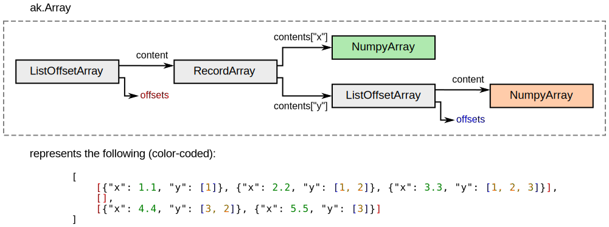

---
jupytext:
  text_representation:
    extension: .md
    format_name: myst
    format_version: 0.13
    jupytext_version: 1.10.3
kernelspec:
  display_name: Python 3
  language: python
  name: python3
---

Direct constructors (fastest)
=============================

If you're willing to think about your data in a columnar way, directly constructing layouts and wrapping them in [ak.Array](https://awkward-array.readthedocs.io/en/latest/_auto/ak.Array.html) interfaces is the fastest way to make them. (All other methods do this at some level.)

"Thinking about data in a columnar way" is the crucial difference between this method and [ArrayBuilder](how-to-create-arraybuilder) and [LayoutBuilder](how-to-create-layoutbuilder). Both of the builders let you think about a data structure the way you would think about Python objects, in which all fields of a given record or elements of a list are "together" and one record or list is "separate" from another record or list. For example,

```{code-cell} ipython3
import awkward as ak
import numpy as np
```

```{code-cell} ipython3
builder = ak.ArrayBuilder()

with builder.list():
    with builder.record():
        builder.field("x").real(1.1)
        with builder.field("y").list():
            builder.integer(1)
    with builder.record():
        builder.field("x").real(2.2)
        with builder.field("y").list():
            builder.integer(1)
            builder.integer(2)
    with builder.record():
        builder.field("x").real(3.3)
        with builder.field("y").list():
            builder.integer(1)
            builder.integer(2)
            builder.integer(3)

with builder.list():
    pass

with builder.list():
    with builder.record():
        builder.field("x").real(4.4)
        with builder.field("y").list():
            builder.integer(3)
            builder.integer(2)
            
    with builder.record():
        builder.field("x").real(5.5)
        with builder.field("y").list():
            builder.integer(3)

array = builder.snapshot()
array
```

```{code-cell} ipython3
array.tolist()
```

gets all of the items in the first list separately from the items in the second or third lists, and both fields of each record (_x_ and _y_) are expressed near each other in the flow of the code and in the times when they're appended.

By contrast, the physical data are laid out in columns, with all _x_ values next to each other, regardless of which records or lists they're in, and all the _y_ values next to each other in another buffer.

```{code-cell} ipython3
array.layout
```

To build arrays using the layout constructors, you need to be able to write them in a form similar to the above, with the data already arranged as columns, in a tree representing the _type structure_ of items in the array, not separate trees for each array element.

+++



+++

The Awkward Array library has a closed set of node types. Building the array structure you want will require you to understand the node types that you use.

The node types (with validity rules for each) are documented under [ak.layout.Content](https://awkward-array.readthedocs.io/en/latest/ak.layout.Content.html), but this tutorial will walk through them explaining the situations in which you'd want to use each.

+++

Contents and Indexes
--------------------

[ak.layout.Content](https://awkward-array.readthedocs.io/en/latest/ak.layout.Content.html) is the _abstract_ superclass of all node types. All Content nodes that you would create are concrete subclasses of this class. The superclass is useful for checking `isinstance(some_object, ak.layout.Content)`, since there are some attributes that are only allowed to be Content nodes.

[ak.layout.Index](https://awkward-array.readthedocs.io/en/latest/ak.layout.Index.html) instances are buffers of integers that are used to give structure to an array. For instance, the `offsets` in the ListOffsetArrays, above, are Indexes, but the NumpyArray of _y_ list contents are not. [ak.layout.NumpyArray](https://awkward-array.readthedocs.io/en/latest/ak.layout.NumpyArray.html) is a subclass of [ak.layout.Content](https://awkward-array.readthedocs.io/en/latest/ak.layout.Content.html), and [ak.layout.Index](https://awkward-array.readthedocs.io/en/latest/ak.layout.Index.html) is not. Indexes are more restricted than general NumPy arrays (must be one-dimensional, C-contiguous integers; dtypes are also prescribed) because they are frequently manipulated by Awkward Array operations, such as slicing.

There are five Index specializations, and each [ak.layout.Content](https://awkward-array.readthedocs.io/en/latest/ak.layout.Content.html) subclass has limitations on which ones it can use.

   * **Index8:** an Index of signed 8-bit integers
   * **IndexU8:** an Index of unsigned 8-bit integers
   * **Index32:** an Index of signed 32-bit integers
   * **IndexU32:** an Index of unsigned 32-bit integers
   * **Index64:** an Index of signed 64-bit integers

+++

Parameters
----------

Each layout node can have arbitrary metadata, called "parameters." Some parameters have built-in meanings, which are described below, and others can be given meanings by defining functions in [ak.behavior](https://awkward-array.readthedocs.io/en/latest/ak.behavior.html).

+++

EmptyArray
----------

[ak.layout.EmptyArray](https://awkward-array.readthedocs.io/en/latest/ak.layout.EmptyArray.html) is one of the two possible leaf types of a layout tree; the other is [ak.layout.NumpyArray](https://awkward-array.readthedocs.io/en/latest/ak.layout.NumpyArray.html). EmptyArray is a trivial node type: it can only represent empty arrays with unknown type.

```{code-cell} ipython3
ak.layout.EmptyArray()
```

```{code-cell} ipython3
ak.Array(ak.layout.EmptyArray())
```

Since this is such a simple node type, let's use it to show examples of adding parameters.

```{code-cell} ipython3
ak.layout.EmptyArray(parameters={"name1": "value1", "name2": {"more": ["complex", "value"]}})
```

NumpyArray
----------

[ak.layout.NumpyArray](https://awkward-array.readthedocs.io/en/latest/ak.layout.NumpyArray.html) is one of the two possible leaf types of a layout tree; the other is [ak.layout.EmptyArray](https://awkward-array.readthedocs.io/en/latest/ak.layout.EmptyArray.html). NumpyArray represents data the same way as a NumPy [np.ndarray](https://numpy.org/doc/stable/reference/generated/numpy.ndarray.html). That is, it can be multidimensional, but only rectilinear arrays.

```{code-cell} ipython3
ak.layout.NumpyArray(np.array([1.1, 2.2, 3.3, 4.4, 5.5]))
```

```{code-cell} ipython3
ak.layout.NumpyArray(np.array([[1, 2, 3], [4, 5, 6]], np.int16))
```

```{code-cell} ipython3
ak.layout.NumpyArray(np.array([1.1, 2.2, 3.3, 4.4, 5.5])[::2])
```

```{code-cell} ipython3
ak.layout.NumpyArray(np.array([[1, 2, 3], [4, 5, 6]], np.int16)[:, 1:])
```

In most array structures, the NumpyArrays only need to be 1-dimensional, since regular-length dimensions can be represented by [ak.layout.RegularArray](https://awkward-array.readthedocs.io/en/latest/ak.layout.RegularArray.html) and variable-length dimensions can be represented by [ak.layout.ListArray](https://awkward-array.readthedocs.io/en/latest/ak.layout.ListArray.html) or [ak.layout.ListOffsetArray](https://awkward-array.readthedocs.io/en/latest/ak.layout.ListOffsetArray.html).

The [ak.from_numpy](https://awkward-array.readthedocs.io/en/latest/_auto/ak.from_numpy.html) function has a `regulararray` argument to choose between putting multiple dimensions into the NumpyArray node or nesting a 1-dimensional NumpyArray in RegularArray nodes.

```{code-cell} ipython3
ak.from_numpy(np.array([[1, 2, 3], [4, 5, 6]], np.int16), regulararray=False, highlevel=False)
```

```{code-cell} ipython3
ak.from_numpy(np.array([[1, 2, 3], [4, 5, 6]], np.int16), regulararray=True, highlevel=False)
```

All of these representations look the same in an [ak.Array](https://awkward-array.readthedocs.io/en/latest/_auto/ak.Array.html) (high-level view).

```{code-cell} ipython3
ak.Array(ak.layout.NumpyArray(np.array([[1, 2, 3], [4, 5, 6]])))
```

```{code-cell} ipython3
ak.Array(ak.layout.RegularArray(ak.layout.NumpyArray(np.array([1, 2, 3, 4, 5, 6])), 3))
```

If you are _producing_ arrays, you can pick any representation that is convenient. If you are _consuming_ arrays, you need to be aware of the different representations.

+++

RegularArray
------------

[ak.layout.RegularArray](https://awkward-array.readthedocs.io/en/latest/ak.layout.RegularArray.html) represents regular-length lists (lists with all the same length). This was shown above as being equivalent to dimensions in a [ak.layout.NumpyArray](https://awkward-array.readthedocs.io/en/latest/ak.layout.NumpyArray.html), but it can also contain irregular data.

```{code-cell} ipython3
layout = ak.layout.RegularArray(
    ak.from_iter([1, 2, 3, 4, 5, 6], highlevel=False),
    3,
)
layout
```

```{code-cell} ipython3
ak.Array(layout)
```

```{code-cell} ipython3
layout = ak.layout.RegularArray(
    ak.from_iter([[], [1], [1, 2], [1, 2, 3], [1, 2, 3, 4], [1, 2, 3, 4, 5]], highlevel=False),
    3,
)
layout
```

```{code-cell} ipython3
ak.Array(layout)
```

The data type for a RegularArray is [ak.types.RegularType](https://awkward-array.readthedocs.io/en/latest/ak.types.RegularType.html), printed above as the "`3 *`" in the type above. (The "`2 *`" describes the length of the array itself, which is always "regular" in the sense that there's only one of them, equal to itself.)

The "`var *`" is the type of variable-length lists, nested inside of the RegularArray.

+++

RegularArray is the first array type that can have unreachable data: the length of its nested content might not evenly divide the RegularArray's regular `size`.

```{code-cell} ipython3
ak.Array(
    ak.layout.RegularArray(
        ak.layout.NumpyArray(np.array([1, 2, 3, 4, 5, 6, 7])),
        3,
    )
)
```

In the high-level array, we only see `[[1, 2, 3], [4, 5, 6]]` and not `7`. Since the 7 items in the nested NumpyArray can't be subdivided into lists of length 3. This `7` exists in the underlying physical data, but in the high-level view, it is as though it did not.

+++

ListArray
---------

[ak.layout.ListArray](https://awkward-array.readthedocs.io/en/latest/ak.layout.ListArray.html) and [ak.layout.ListOffsetArray](https://awkward-array.readthedocs.io/en/latest/ak.layout.ListOffsetArray.html) are the two node types that describe variable-length lists ([ak.types.ListType](https://awkward-array.readthedocs.io/en/latest/ak.types.ListType.html), represented in type strings as "`var *`").

[ak.layout.ListArray](https://awkward-array.readthedocs.io/en/latest/ak.layout.ListArray.html) is the most general. It takes two Indexes, `starts` and `stops`, which indicate where each nested list starts and stops.

```{code-cell} ipython3
layout = ak.layout.ListArray64(
    ak.layout.Index64(np.array([0, 3, 3])),
    ak.layout.Index64(np.array([3, 3, 5])),
    ak.layout.NumpyArray(np.array([1.1, 2.2, 3.3, 4.4, 5.5])),
)
layout
```

```{code-cell} ipython3
ak.Array(layout)
```

The nested content, `[1.1, 2.2, 3.3, 4.4, 5.5]` is divided into three lists, `[1.1, 2.2, 3.3]`, `[]`, `[4.4, 5.5]` by `starts=[0, 3, 3]` and `stops=[3, 3, 5]`. That is to say, the first list is drawn from indexes `0` through `3` of the content, the second is empty (from `3` to `3`), and the third is drawn from indexes `3` through `5`.

+++

ListOffsetArray
---------------

[ak.layout.ListOffsetArray](https://awkward-array.readthedocs.io/en/latest/ak.layout.ListOffsetArray.html) and [ak.layout.ListArray](https://awkward-array.readthedocs.io/en/latest/ak.layout.ListArray.html) are the two node types that describe variable-length lists ([ak.types.ListType](https://awkward-array.readthedocs.io/en/latest/ak.types.ListType.html), represented in type strings as "`var *`").

+++

RecordArray and Record
----------------------

[ak.layout.RecordArray](https://awkward-array.readthedocs.io/en/latest/ak.layout.RecordArray.html)

+++

IndexedArray
------------

[ak.layout.IndexedArray](https://awkward-array.readthedocs.io/en/latest/ak.layout.IndexedArray.html)

+++

IndexedOptionArray
------------------

[ak.layout.IndexedOptionArray](https://awkward-array.readthedocs.io/en/latest/ak.layout.IndexedOptionArray.html)

+++

ByteMaskedArray
---------------

[ak.layout.ByteMaskedArray](https://awkward-array.readthedocs.io/en/latest/ak.layout.ByteMaskedArray.html)

+++

BitMaskedArray
--------------

[ak.layout.BitMaskedArray](https://awkward-array.readthedocs.io/en/latest/ak.layout.BitMaskedArray.html)

+++

UnmaskedArray
-------------

[ak.layout.UnmaskedArray](https://awkward-array.readthedocs.io/en/latest/ak.layout.UnmaskedArray.html)

+++

UnionArray
----------

[ak.layout.UnionArray](https://awkward-array.readthedocs.io/en/latest/ak.layout.UnionArray.html)

+++

VirtualArray
------------

[ak.layout.VirtualArray](https://awkward-array.readthedocs.io/en/latest/ak.layout.VirtualArray.html)

+++

PartitionedArray and IrregularlyPartitionedArray
------------------------------------------------

[ak.partition.PartitionedArray](https://awkward-array.readthedocs.io/en/latest/_auto/ak.partition.PartitionedArray.html)'s subclass, [ak.partition.IrregularlyPartitionedArray](https://awkward-array.readthedocs.io/en/latest/_auto/ak.partition.IrregularlyPartitionedArray.html), is not a [ak.layout.Content](https://awkward-array.readthedocs.io/en/latest/ak.layout.Content.html) subclass, deliberately preventing it from being used within a layout tree. It can, however, be the _root_ of a layout tree within an [ak.Array](https://awkward-array.readthedocs.io/en/latest/_auto/ak.Array.html). This reflects our view that partitioning is only useful (and easiest to get right) for whole arrays, not internal nodes of a columnar structure.

+++

Relationship to ak.from_buffers
-------------------------------

The [generic buffers](how-to-convert-buffers) tutorial describes a function, [ak.from_buffers](https://awkward-array.readthedocs.io/en/latest/_auto/ak.from_buffers.html) that builds an array from one-dimensional buffers and an [ak.forms.Form](https://awkward-array.readthedocs.io/en/latest/ak.forms.Form.html). Forms describe the complete tree structure of an array without the array data or lengths, and the array data are in the buffers. The [ak.from_buffers](https://awkward-array.readthedocs.io/en/latest/_auto/ak.from_buffers.html) function was designed to operate on data produced by [ak.to_buffers](https://awkward-array.readthedocs.io/en/latest/_auto/ak.to_buffers.html), but you can also prepare its `form`, `length`, and `buffers` manually.

The [ak.from_buffers](https://awkward-array.readthedocs.io/en/latest/_auto/ak.from_buffers.html) builds arrays using the above constructors, but the interface allows these structures to be built as data, rather than function calls. (Forms have a JSON representation.) If you are always building the same type of array, directly calling the constructors is likely easier. If you're generating different data types programmatically, preparing data for [ak.from_buffers](https://awkward-array.readthedocs.io/en/latest/_auto/ak.from_buffers.html) may be easier than generating and evaluating Python code that call these constructors.

Every [ak.layout.Content](https://awkward-array.readthedocs.io/en/latest/ak.layout.Content.html) subclass has a corresponding [ak.forms.Form](https://awkward-array.readthedocs.io/en/latest/ak.forms.Form.html), and you can see a layout's Form through its `form` property.

```{code-cell} ipython3
array = ak.Array([[1.1, 2.2, 3.3], [], [4.4, 5.5]])
array.layout
```

```{code-cell} ipython3
# Abbreviated JSON representation
array.layout.form
```

```{code-cell} ipython3
# Full JSON representation
print(array.layout.form.tojson(pretty=True))
```

In this way, you can figure out how to generate Forms corresponding to the Content nodes you want [ak.from_buffers](https://awkward-array.readthedocs.io/en/latest/_auto/ak.from_buffers.html) to make.
